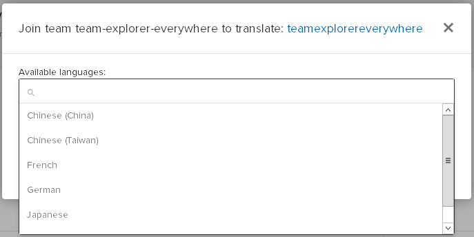

We’re using an open localization platform to regularly integrate community feedback and contributions into our products.

##Where are our translations? 
* Go to [www.transifex.com](https://www.transifex.com/), sign in if you have a **Transifex** account, sign up for an account if you don’t have one.

##Request for access to “Team Explorer Everywhere”
* Go to [www.transifex.com/microsoft-oss/team-explorer-everywhere](https://www.transifex.com/microsoft-oss/team-explorer-everywhere/).
* Click  
* Select the language you want to contribute to.

* Click the Join button.
* You will receive a notification when your request is approved.

##How do I start contributing?
* Go to [www.transifex.com/microsoft-oss/team-explorer-everywhere](https://www.transifex.com/microsoft-oss/team-explorer-everywhere/).
* Select your requested language.
* Click  
* Select a particular resource or choose "All resources" to see all strings in the product.  

###Reviewing and voting on translations
* Review the suggestions and vote  ,  .

###Adding new translation suggestions
* Click  to suggest a new translation.

###Adding new language support
If you want to add new language support for TEE, please follow below steps to request a new language.
* Go to [www.transifex.com/microsoft-oss/team-explorer-everywhere](https://www.transifex.com/microsoft-oss/team-explorer-everywhere/).
* Click the  entry under Team Explorer Everywhere in left pane.
* Then click **Edit Languages** icon .
* Enter language you want to add  and click **Apply**.

###Adding feedback 
* Click  and .

